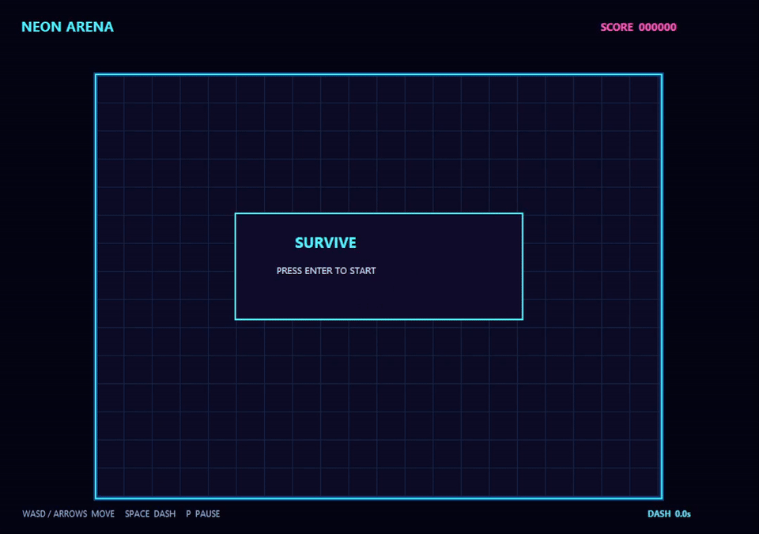

# Neon Arena

**Neon Arena** 是一个个人 C++ 游戏客户端原型：在一个俯视角霓虹竞技场中操控角色躲避追踪敌人，尽可能延长生存时间并累积得分。它的目标是用小而完整的可运行项目，展示 Windows 客户端、实时游戏循环、输入处理和可测试玩法逻辑的基本功；并非商业成品。



## 玩法与操作

- `Enter`：在开始界面开始游戏；游戏结束后重新开始。
- `WASD` 或方向键：移动。
- `Space`：短距离冲刺；冲刺有持续时间和冷却。
- `P`：暂停或继续。

敌人从竞技场边缘按固定节奏生成并追向玩家。碰撞后本局结束；存活时间会转换为分数。

## 构建、测试与运行

环境：Windows、PowerShell、可用的 MinGW `g++`（支持 C++17）。以下命令都从项目根目录执行：

```powershell
# 构建 Win32 可执行文件
.\scripts\build.ps1

# 运行核心玩法单元测试与 Win32 消息路由测试
.\scripts\test-all.ps1

# 构建后启动检查：验证进程短暂存活，再关闭该进程
.\scripts\smoke.ps1

# 手动运行
.\build\neon_arena.exe

# 可选：录制本机游戏窗口并导出 README GIF（需要 ffmpeg）
.\scripts\capture-demo.ps1
```

项目也提供 `CMakeLists.txt`，可在安装 CMake 的环境中使用 CMake 生成构建；本机验证未运行 CMake，因为本地未安装该工具。

## 技术栈

- C++17
- 原生 Win32 API：窗口、消息循环与键盘消息
- GDI：2D 图形、文本与双缓冲绘制
- PowerShell：构建、测试与启动冒烟检查
- MinGW `g++`：当前验证使用的编译器

## 架构与模块边界

| 模块 | 位置 | 职责 |
| --- | --- | --- |
| Core | `src/core` | 小型数学值类型，例如 `Vec2`。 |
| Game | `src/game` | 运行状态、玩家/敌人更新、生成、碰撞、得分；不依赖窗口，因此可独立测试。 |
| Platform | `src/platform` | Win32 窗口和消息处理、输入快照、固定步长驱动与 GDI 渲染。 |
| App | `src/app` | `WinMain` 组合根，启动 `Win32App`。 |
| Tests / Scripts | `tests`、`scripts` | 玩法和消息路由回归测试，以及构建、聚合测试、启动冒烟检查。 |

平台层每个模拟步向游戏层传入一个 `InputState`；游戏层只维护可渲染状态和玩法规则，渲染器不反向决定玩法。这让核心规则能在没有 GUI、显示器或资源文件的情况下被测试。

## 关键实现选择

- **固定 timestep**：Win32 循环以 `1/60 s` 累加器推进模拟，并限制异常大的 frame delta，减少帧率波动或窗口卡顿带来的物理跳变。
- **输入边沿处理**：平台层分别保存按住状态和本帧首次按下状态；自动重复键不重复触发 `Enter`、`P` 和冲刺等一次性动作。
- **值语义所有权**：`GameConfig`、敌人位置和游戏状态以值类型与 `std::vector` 保存，不使用原始拥有指针，重开时可恢复干净状态。
- **确定性生成**：敌人生成使用配置化种子的简单伪随机序列；相同输入与配置可复现生成行为，便于测试。生成循环还限制单次补偿波数，避免长卡顿后突发积压。

## 面试可展开的点

- 这是一个从 `WinMain`、消息泵到渲染和可玩交互的原生 Windows 客户端闭环，可说明事件循环、窗口生命周期和 GDI 资源释放。
- 游戏规则与平台层解耦，核心逻辑能以普通 C++ 测试执行；可说明如何降低客户端逻辑的回归风险。
- 固定步长、输入边沿、暂停/重开状态机和 delta 限制对应实时交互中常见的稳定性问题。
- 生成可复现、状态由值拥有，便于定位问题、扩展配置并保障重开一致性。
- 该原型刻意不含网络同步、资源管线、音频或商业化系统；这些是后续可按产品需求扩展的方向，而不是本项目已实现的能力。
